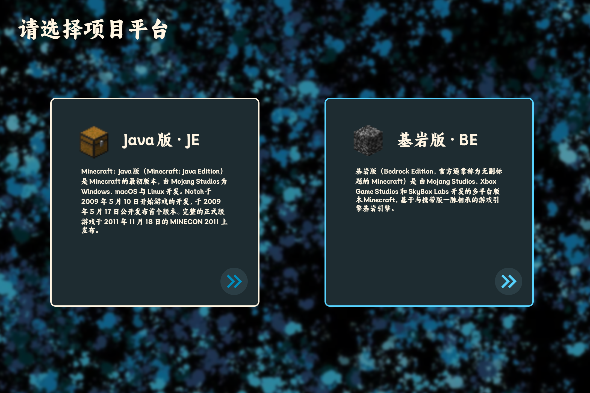

# 声致发光项目组 2024 年年终报告

## 一、项目概述

本项目于 2024 年 11 月 10 日正式立项，旨在搭建一个。目前团队配置如下：

- **前端开发**：1 人 (@Jim-Lin-4549)
- **后端开发**：1 人 (@alazeprt)

---

## 二、开发进展

### 1. 前端开发

#### 已完成内容

- 主页面设计与开发 ✅（已上线预览）
  
- 子项目选择页面 ✅（已上线预览）
  

#### 开发中内容

- 用户协议页面 🟨（进展中）

#### 待开发内容

- 子项目页面（Java/Bedrock）🕑（计划中）

#### 问题与解决方案

- **页面适配（响应式）**
    - **当前解决方案**：手动编写了响应式 HTML 和 CSS 布局代码。
    - **未来计划**：引入现成的响应式框架（如 Bootstrap 或 Tailwind CSS）以优化开发效率，并重新设计页面架构以适配更多设备。

### 2. 后端开发

后端开发目前尚未开始，计划与平台用户系统进行深度对接。

---

## 三、2025 年开发计划

1. **完善前端功能**

- 完善用户协议确认机制。
- 优化子项目页面（Java/Bedrock）的用户体验。

2. **后端开发重点**

- 完成平台用户系统的对接。
- 搭建 Bedrock 分区相关功能模块并实现数据同步。

3. **整体优化**

- 引入自动化测试流程，确保代码质量与稳定性。
- 持续优化用户体验，增加系统可扩展性。

---

文案：Jim Lin \
图片：Jim Lin \
加班加点：Jim Lin

2024/12/28